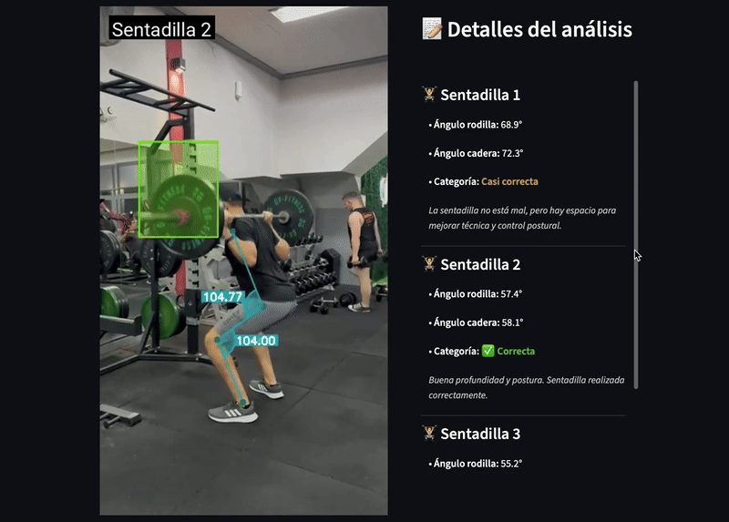

# 🏋️‍♂️ GymTracker

**GymTracker** es una aplicación diseñada para analizar ejercicios físicos, comenzando con la **sentadilla (squat)**. El sistema procesa un video en formato `.mp4` y genera:

- Un **video procesado** con visualizaciones.
- **Feedback detallado** sobre la técnica utilizada.
- Un **gráfico** que representa el recorrido del ejercicio.

<div style="text-align: center;">
    
</div>

---

## 🎯 Objetivo

El objetivo de GymTracker es ayudar a deportistas, entrenadores y fisioterapeutas a evaluar la técnica de ejecución de ejercicios físicos utilizando visión por computadora y modelos de IA.

A través de la identificación de la barra (**barbell**) y los ángulos articulares, el sistema provee retroalimentación objetiva sobre el rendimiento técnico de una repetición.

---

## ⚙️ Características

- ✅ Análisis de sentadillas con retroalimentación visual y textual.
- ✅ Procesamiento automático de videos en formato `.mp4`.
- ✅ Cálculo de ángulos de rodilla y cadera usando **MediaPipe**.
- ✅ Detección del **barbell** con modelo YOLOv5.
- ✅ Gráfico de recorrido del ejercicio.
- ✅ Interfaz visual con Streamlit.

---

## 📁 Estructura del Proyecto

```
.
├── README.md
├── backend
│   ├── Dockerfile                 # Imagen del backend
│   ├── excercises.py              # Lógica del análisis de sentadilla
│   ├── fonts
│   │   └── Roboto-Regular.ttf     # Fuente para overlay de video
│   ├── main.py                    # Backend API con FastAPI
│   ├── requirements.txt           # Dependencias del backend
│   ├── utils.py                   # Utilidades generales
│   └── yolo_best.pt               # Modelo YOLOv5 para detección de barra
├── docker-compose.yml             # Orquestador de frontend y backend
└── frontend
    ├── Dockerfile                 # Imagen del frontend
    ├── frontend.py                # Interfaz de usuario con Streamlit
    └── requirements.txt           # Dependencias del frontend
```

---

## 🚀 Cómo ejecutar el proyecto

1. Asegúrate de tener [Docker](https://www.docker.com/) y [Docker Compose](https://docs.docker.com/compose/) instalados.

2. En la raíz del proyecto, ejecuta:

```
docker-compose up --build
```

3. Esto construirá y levantará tanto el **backend (FastAPI)** como el **frontend (Streamlit)**.

4. Accede al frontend a través de:
   - [http://localhost:8501](http://localhost:8501)

---

## 📂 Directorios generados

Durante la ejecución del análisis, se generarán automáticamente los siguientes directorios dentro de `backend/`:

- `upload/`: donde se almacenan los videos originales subidos por el usuario.
- `processed/`: donde se guardan los videos procesados y editados con anotaciones.

---

## 📌 Tecnologías utilizadas

- **Python**
- **OpenCV**: para procesamiento de video.
- **MediaPipe**: para el cálculo de ángulos articulares.
- **YOLOv5**: para detección de objetos (barra).
- **Matplotlib**: para la generación de gráficos.
- **Streamlit**: frontend de visualización.
- **FastAPI**: backend de análisis.
- **Docker**: contenedores y despliegue.

---

## 📈 Ejemplo de feedback generado

```
### 🏋️ Sentadilla 1
- Ángulo rodilla: 68.9°
- Ángulo cadera: 72.3°
✅ Categoría: Correcta
> Buena profundidad y postura. Sentadilla realizada correctamente.
```

---

## 📬 Contacto

¿Te gustaría contribuir, reportar un bug o mejorar el sistema?

Contactame a través de:
- **GitHub**: [lucascarmu](https://github.com/lucascarmu)
- **Email**: lucascarmusciano@gmail.com
- **LinkedIn**: [Lucas Carmu](https://www.linkedin.com/in/lucas-carmu/)

---

## 📝 Licencia

Este proyecto está licenciado bajo la **Licencia MIT**.  
Ver el archivo [LICENSE](./LICENSE) para más detalles.

